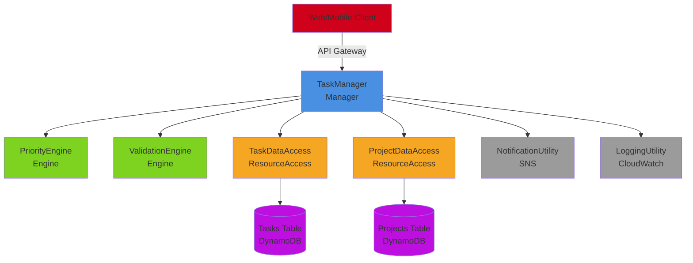
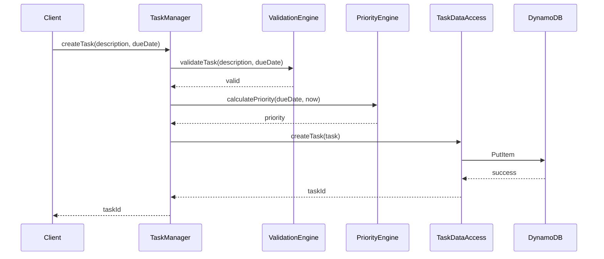

# Task Management System

A simple task management system demonstrating foundational concepts of The Method on AWS.

## Business Context

### Overview

A productivity application that allows users to create, organize, and complete tasks with priority management and notifications.

### Requirements

- Users can create tasks with descriptions and due dates
- System calculates task priority based on due date
- Users can mark tasks as complete
- System sends notifications for due tasks
- Tasks are organized into projects

### Stakeholders

- End users (individuals managing personal tasks)
- Team leads (managing team tasks)
- System administrators

## Volatility Analysis

### Identified Volatile Areas

1. **Task Workflow Volatility**
   - **What changes**: Sequence of operations when creating/completing tasks
   - **Why volatile**: Business may add approval steps, validation rules, or workflow stages
   - **Component**: TaskManager
   - **Encapsulation**: Manager orchestrates the workflow

2. **Priority Calculation Volatility**
   - **What changes**: Algorithm for calculating task priority
   - **Why volatile**: Business rules for priority may evolve (urgency, importance, dependencies)
   - **Component**: PriorityEngine
   - **Encapsulation**: Engine contains priority logic

3. **Task Data Access Volatility**
   - **What changes**: How tasks are stored and retrieved
   - **Why volatile**: May switch from DynamoDB to RDS, add caching, change schema
   - **Component**: TaskDataAccess
   - **Encapsulation**: ResourceAccess abstracts storage

4. **Notification Delivery Volatility**
   - **What changes**: How notifications are sent (email, SMS, push)
   - **Why volatile**: Notification channels may change
   - **Component**: NotificationUtility
   - **Encapsulation**: Utility handles cross-cutting notification concern

## Architecture Design

### Component Diagram



### Layer Diagram

```
┌─────────────────────────────────────┐
│         Client Layer                │
│  Web UI, Mobile App                 │
└─────────────────────────────────────┘
              ↓
┌─────────────────────────────────────┐
│    Business Logic Layer             │
│  TaskManager                        │
│  PriorityEngine, ValidationEngine   │
└─────────────────────────────────────┘
              ↓
┌─────────────────────────────────────┐
│    Resource Access Layer            │
│  TaskDataAccess, ProjectDataAccess  │
└─────────────────────────────────────┘
              ↓
┌─────────────────────────────────────┐
│         Resource Layer              │
│  Tasks Table, Projects Table        │
└─────────────────────────────────────┘

┌─────────────────────────────────────┐
│         Utilities Bar               │
│  NotificationUtility, LoggingUtility│
└─────────────────────────────────────┘
```

### Component Descriptions

**TaskManager** (Manager)

- Orchestrates task creation and completion workflows
- Calls PriorityEngine to calculate priority
- Calls ValidationEngine to validate task data
- Calls TaskDataAccess to persist tasks
- Calls NotificationUtility for notifications

**PriorityEngine** (Engine)

- Calculates task priority based on due date and creation date
- Pure business logic, no I/O
- Reusable across different Managers

**ValidationEngine** (Engine)

- Validates task data (description not empty, due date in future)
- Pure business logic
- Reusable for different validation scenarios

**TaskDataAccess** (ResourceAccess)

- Exposes atomic business verbs: createTask, getTask, markTaskAsComplete
- Encapsulates DynamoDB access patterns
- NOT generic CRUD operations

**ProjectDataAccess** (ResourceAccess)

- Exposes atomic business verbs: createProject, getProject, addTaskToProject
- Encapsulates project storage

## AWS Service Mapping

### Deployment Diagram

```
API Gateway → TaskManager Lambda
                ↓
          PriorityEngine Lambda
          ValidationEngine Lambda
                ↓
          TaskDataAccess Lambda → DynamoDB (Tasks)
          ProjectDataAccess Lambda → DynamoDB (Projects)
                ↓
          NotificationUtility → SNS
          LoggingUtility → CloudWatch
```

### Service Selection Rationale

| Component           | AWS Service | Justification                                |
| ------------------- | ----------- | -------------------------------------------- |
| TaskManager         | Lambda      | Simple workflow, doesn't need Step Functions |
| PriorityEngine      | Lambda      | Stateless business logic                     |
| ValidationEngine    | Lambda      | Stateless validation logic                   |
| TaskDataAccess      | Lambda      | Data access abstraction                      |
| ProjectDataAccess   | Lambda      | Data access abstraction                      |
| Tasks Table         | DynamoDB    | NoSQL, simple key-value access               |
| Projects Table      | DynamoDB    | NoSQL, simple key-value access               |
| NotificationUtility | SNS         | Pub/sub messaging                            |
| LoggingUtility      | CloudWatch  | Centralized logging                          |

## Use Case Flows

### Use Case 1: Create Task

**Scenario**: User creates a new task with description and due date

**Call Chain**:

```
1. Client → API Gateway → TaskManager.createTask()
2. TaskManager → ValidationEngine.validateTask()
3. TaskManager → PriorityEngine.calculatePriority()
4. TaskManager → TaskDataAccess.createTask()
5. TaskManager → NotificationUtility.scheduleNotification()
6. TaskManager → LoggingUtility.log()
7. TaskManager → Client (return taskId)
```

**Sequence Diagram**:



### Use Case 2: Complete Task

**Scenario**: User marks a task as complete

**Call Chain**:

```
1. Client → API Gateway → TaskManager.completeTask()
2. TaskManager → TaskDataAccess.markTaskAsComplete()
3. TaskManager → NotificationUtility.sendCompletionNotification()
4. TaskManager → LoggingUtility.log()
5. TaskManager → Client (return success)
```

## Implementation Highlights

### Interface Definitions

```typescript
// Manager interface
interface ITaskManager {
  createTask(
    description: string,
    dueDate: Date,
    projectId?: string,
  ): Promise<string>;
  completeTask(taskId: string): Promise<void>;
  getTask(taskId: string): Promise<Task>;
}

// Engine interfaces
interface IPriorityEngine {
  calculatePriority(dueDate: Date, createdDate: Date): Promise<number>;
}

interface IValidationEngine {
  validateTask(description: string, dueDate: Date): Promise<ValidationResult>;
}

// ResourceAccess interface (atomic business verbs)
interface ITaskDataAccess {
  createTask(task: Task): Promise<string>;
  getTask(taskId: string): Promise<Task>;
  markTaskAsComplete(taskId: string): Promise<void>;
  // NOT: updateTask(), deleteTask()
}
```

### Lambda Function Structure

```typescript
// TaskManager Lambda
export const handler = async (
  event: APIGatewayEvent,
): Promise<APIGatewayResponse> => {
  const { description, dueDate, projectId } = JSON.parse(event.body);

  // Validate
  const validationResult = await validationEngine.validateTask(
    description,
    dueDate,
  );
  if (!validationResult.valid) {
    return { statusCode: 400, body: JSON.stringify(validationResult.errors) };
  }

  // Calculate priority
  const priority = await priorityEngine.calculatePriority(dueDate, new Date());

  // Create task
  const task = {
    taskId: generateId(),
    description,
    dueDate,
    createdDate: new Date(),
    priority,
    status: "pending",
    projectId,
  };

  const taskId = await taskDataAccess.createTask(task);

  // Log
  await loggingUtility.log("info", "Task created", { taskId });

  return {
    statusCode: 201,
    body: JSON.stringify({ taskId }),
  };
};
```

### CDK Infrastructure

```typescript
// Resources
const tasksTable = new dynamodb.Table(this, "TasksTable", {
  partitionKey: { name: "taskId", type: dynamodb.AttributeType.STRING },
  billingMode: dynamodb.BillingMode.PAY_PER_REQUEST,
});

// Engines
const priorityEngine = new lambda.Function(this, "PriorityEngine", {
  runtime: lambda.Runtime.NODEJS_18_X,
  handler: "priority-engine.handler",
  code: lambda.Code.fromAsset("dist/engines"),
});

// ResourceAccess
const taskDataAccess = new lambda.Function(this, "TaskDataAccess", {
  runtime: lambda.Runtime.NODEJS_18_X,
  handler: "task-data-access.handler",
  code: lambda.Code.fromAsset("dist/resource-access"),
  environment: {
    TASKS_TABLE: tasksTable.tableName,
  },
});
tasksTable.grantReadWriteData(taskDataAccess);

// Manager
const taskManager = new lambda.Function(this, "TaskManager", {
  runtime: lambda.Runtime.NODEJS_18_X,
  handler: "task-manager.handler",
  code: lambda.Code.fromAsset("dist/managers"),
  environment: {
    PRIORITY_ENGINE_ARN: priorityEngine.functionArn,
    TASK_DATA_ACCESS_ARN: taskDataAccess.functionArn,
  },
});
priorityEngine.grantInvoke(taskManager);
taskDataAccess.grantInvoke(taskManager);

// Client
const api = new apigateway.RestApi(this, "TaskApi");
const tasks = api.root.addResource("tasks");
tasks.addMethod("POST", new apigateway.LambdaIntegration(taskManager));
```

## Lessons Learned

### Key Takeaways

1. **Volatility Encapsulation**: Each component encapsulates a specific type of change
   - TaskManager: Workflow changes
   - PriorityEngine: Priority calculation changes
   - TaskDataAccess: Storage changes

2. **Atomic Business Verbs**: TaskDataAccess uses `createTask()` and `markTaskAsComplete()`, not generic CRUD

3. **Layer Communication**: Client → Manager → Engine/ResourceAccess → Resource

4. **AWS Service Mapping**: Simple workflows use Lambda, complex workflows use Step Functions

### Concepts Introduced

- Basic component types (Manager, Engine, ResourceAccess, Resource, Utility)
- Volatility-based decomposition
- Atomic business verbs
- Layer communication rules
- AWS service selection

### Design Decisions

**Why Lambda for Manager?**

- Simple workflow (validate → calculate → store)
- Doesn't need visual workflow orchestration
- Cost-effective for simple use cases

**Why DynamoDB for Storage?**

- Simple key-value access pattern
- No complex queries or joins needed
- Serverless, scales automatically

**Why Separate Engines?**

- Priority calculation may change independently
- Validation rules may change independently
- Engines can be reused by other Managers

## Next Steps

- **[E-Commerce Example](e-commerce.md)** - More complex system with Step Functions
- **[Best Practices](../reference/best-practices.md)** - Component design best practices
