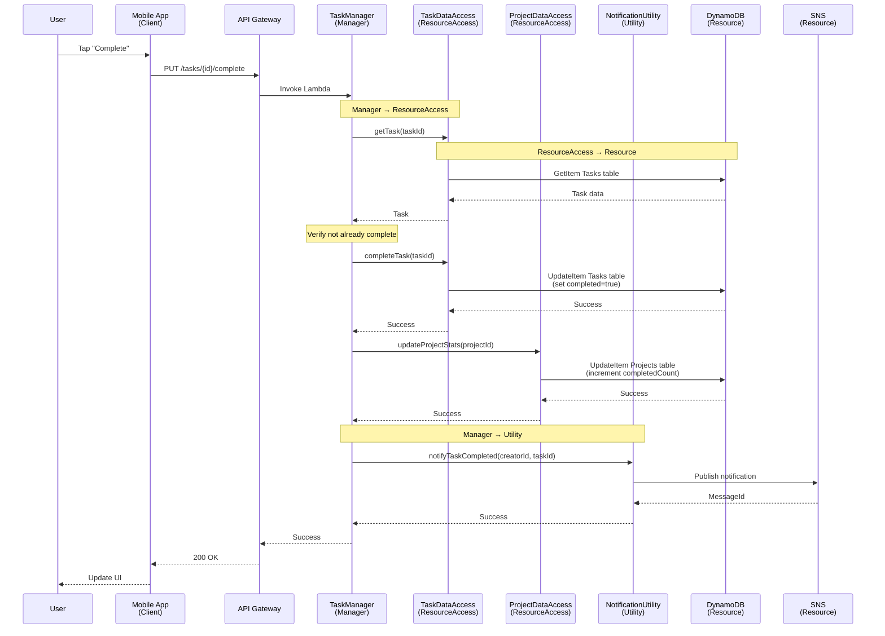

# Applying The Method to AWS Serverless Services

**A Practical Guide to Volatility-Based System Design in the Cloud**

---

**Attribution**: This guide is based on **"Righting Software"** by Juval Löwy (Addison-Wesley, 2019), which introduces **The Method**—a structured engineering approach to system and project design. All core architectural principles (volatility-based decomposition, component taxonomy, and layered architecture) are attributed to Juval Löwy's work. This guide's contribution is demonstrating how these proven principles naturally map to AWS serverless services.

---

## Table of Contents

### Part 1: Foundation

- [Introduction](introduction.md)
- [Core Principles](core-principles.md)
- [Component Taxonomy](component-taxonomy.md)

### Part 2: System Examples

- [Example 1: Task Management System](#example-1-task-management-system)
- Example 2: E-Commerce Order Processing (Coming Soon)
- Example 3: Real-Time Trading System (Coming Soon)
- Example 4: Content Management Platform (Coming Soon)

### Part 3: Synthesis

- Cross-Cutting Patterns (Coming Soon)
- Best Practices Checklist (Coming Soon)
- AWS Service Selection Guide (Coming Soon)
- Common Anti-Patterns (Coming Soon)

---

## How to Use This Guide

This guide teaches through progressive examples. Start with the Foundation section to understand The Method's core principles, then work through the system examples in order. Each example builds on concepts from previous ones.

**For beginners**: Read everything in sequence, starting with the Introduction.

**For experienced architects**: Skim the Foundation, then dive into the examples that match your domain.

**For AWS practitioners**: Focus on the AWS Service Mapping sections to see how The Method maps to services you already know.

---

# Part 2: System Examples

## Example 1: Task Management System

**Complexity**: Simple (Foundation)
**Domain**: Productivity/Collaboration
**Purpose**: Introduce foundational concepts of The Method applied to AWS

### Business Context

#### Domain Overview

We're building a task management system for teams—think of it as a simplified version of tools like Asana, Trello, or Jira. The system helps users organize their work by creating tasks, setting priorities, tracking progress, and collaborating with team members.

This is a productivity and collaboration domain where the primary value is helping individuals and teams stay organized and productive. The system needs to be simple enough for anyone to use but powerful enough to handle real work.

#### Business Requirements

The system must support these core capabilities:

**Task Management**

- Users can create tasks with descriptions, due dates, and priority levels
- Users can update task details (description, due date, priority)
- Users can mark tasks as complete
- Users can delete tasks they created
- Tasks can be assigned to specific users

**Project Organization**

- Users can create projects to group related tasks
- Tasks belong to a single project
- Users can view all tasks within a project
- Projects have names and descriptions

**Priority System**

- Tasks have priority levels: Low, Medium, High, Urgent
- Priority can be set manually by users
- System suggests priority based on due date proximity
- Overdue tasks automatically escalate to higher priority

**Notifications**

- Users receive notifications when tasks are assigned to them
- Users receive reminders for tasks approaching their due date
- Users receive notifications when task details change

**User Management**

- Users can create accounts and log in
- Users can view their assigned tasks
- Users can view tasks they created
- Basic profile information (name, email)

#### Stakeholders

**Primary Users**

- Individual contributors who need to track their own work
- Team leads who assign and monitor tasks
- Project managers who oversee multiple projects

**Success Criteria**

- Users can create and complete tasks in under 30 seconds
- Task priority suggestions are accurate 80% of the time
- Notifications are delivered within 1 minute of trigger events
- System handles 1,000 concurrent users without performance degradation
- 99.9% uptime during business hours

#### Key Business Constraints

**Simplicity First**: This is a foundational example, so we're keeping it simple. No complex workflows, no advanced features, just the core task management capabilities.

**Cost Efficiency**: The system should use serverless services to minimize operational costs. Pay only for what we use.

**Scalability**: While we start small, the architecture should scale naturally as the user base grows.

**Maintainability**: The codebase should be easy to understand and modify as requirements evolve (which they will).

#### What Makes This Interesting

This example is perfect for learning The Method because:

1. **Clear Volatility**: We can easily identify what's likely to change (priority rules, notification methods, task workflows)
2. **Simple Enough**: Not overwhelming with complexity, so we can focus on principles
3. **Real-World**: Everyone understands task management, so we can focus on architecture rather than domain knowledge
4. **Foundation for Growth**: The patterns we establish here will scale to more complex examples

#### What We're NOT Building

To keep this example focused, we're explicitly excluding:

- Complex workflow automation (no "when X happens, do Y")
- Time tracking or reporting
- File attachments or comments
- Real-time collaboration features
- Mobile apps (we'll focus on the backend architecture)
- Advanced search or filtering

These features would be great additions, but they'd distract from learning The Method's core principles. We'll see more complex features in later examples.

---

**Next Section**: [Volatility Analysis](#volatility-analysis) - Identifying what changes and how to encapsulate it

### Volatility Analysis

Now that we understand what we're building, let's identify what's likely to change. This is the heart of The Method—decomposing the system based on volatility rather than function.

#### What is Volatility?

Volatility is not the same as variability. Variability means something can have different values (like a task's priority can be Low, Medium, or High). Volatility means the requirements themselves are likely to change over time.

For example:

- **Variable**: A task can have different priority values → This is just data
- **Volatile**: The rules for calculating priority might change → This needs encapsulation

We're looking for areas where the business is likely to say "actually, we need to change how this works."

#### Identifying Volatile Areas

Let's walk through the task management system and identify what's volatile:

**1. Use Case Workflow Volatility**

**What changes**: The sequence of operations when creating, updating, or completing tasks.

**Why it's volatile**:

- Today: Create task → Validate → Save → Notify
- Tomorrow: Create task → Validate → Check permissions → Save → Update project stats → Notify → Log audit trail
- Next month: Add approval workflow for high-priority tasks

The business will want to add steps, reorder operations, or introduce conditional logic. This is classic workflow volatility.

**Encapsulation strategy**: Create a **TaskManager** component that owns the workflow. When the sequence changes, we only modify the Manager—not the validation logic, not the data access, not the notification system.

**Component type**: Manager (encapsulates use case sequence volatility)

---

**2. Priority Calculation Volatility**

**What changes**: The rules for determining task priority.

**Why it's volatile**:

- Today: Priority is manually set by users
- Tomorrow: Auto-suggest priority based on due date (< 1 day = Urgent, < 3 days = High, etc.)
- Next month: Consider project importance, user workload, task dependencies
- Future: Machine learning model based on historical completion patterns

Priority rules are business logic that will evolve as the team learns what works. This is algorithm volatility.

**Encapsulation strategy**: Create a **PriorityEngine** component that owns priority calculation. When the rules change, we only touch this Engine—the Manager doesn't care how priority is calculated, just that it gets a result.

**Component type**: Engine (encapsulates business activity volatility)

---

**3. Validation Rules Volatility**

**What changes**: The rules for what makes a valid task.

**Why it's volatile**:

- Today: Task must have a description and due date
- Tomorrow: Description must be at least 10 characters, due date can't be in the past
- Next month: Tasks in certain projects require additional fields
- Future: Custom validation rules per team

Validation rules change as the business refines what "valid" means. This is another form of business logic volatility.

**Encapsulation strategy**: Create a **ValidationEngine** component that owns validation rules. When validation changes, we modify only this Engine.

**Component type**: Engine (encapsulates business activity volatility)

---

**4. Data Access Volatility**

**What changes**: How we store and retrieve tasks.

**Why it's volatile**:

- Today: DynamoDB with simple key-value access
- Tomorrow: Add secondary indexes for querying by project, user, due date
- Next month: Add caching layer for frequently accessed tasks
- Future: Move to different database, add read replicas, implement sharding

The physical storage mechanism and access patterns will evolve. This is resource access volatility.

**Encapsulation strategy**: Create **TaskDataAccess** and **ProjectDataAccess** components that expose atomic business operations (not CRUD). When storage changes, we only modify these components—the business logic doesn't know or care about DynamoDB.

**Component type**: ResourceAccess (encapsulates resource access volatility)

**Critical principle**: These components expose business verbs like `createTask()`, `completeTask()`, `assignTaskToUser()`, NOT generic operations like `update()` or `write()`. This keeps the interface stable even when the underlying storage changes.

---

**5. Notification Delivery Volatility**

**What changes**: How notifications are sent to users.

**Why it's volatile**:

- Today: Email via SNS
- Tomorrow: Add push notifications for mobile app
- Next month: Add Slack integration
- Future: SMS, in-app notifications, webhook integrations

Notification delivery is a cross-cutting concern that will expand over time. This is utility volatility.

**Encapsulation strategy**: Create a **NotificationUtility** component that abstracts notification delivery. When we add new channels, we extend this Utility—the business logic just says "notify this user" without caring about the mechanism.

**Component type**: Utility (encapsulates cross-cutting infrastructure concern)

---

#### Volatility Mapping Summary

Here's how we map each volatile area to a component:

| Volatile Area              | Change Driver              | Component           | Type           | Rationale                          |
| -------------------------- | -------------------------- | ------------------- | -------------- | ---------------------------------- |
| Task workflow sequence     | Business process evolution | TaskManager         | Manager        | Orchestrates the use case flow     |
| Priority calculation rules | Business logic refinement  | PriorityEngine      | Engine         | Encapsulates priority algorithm    |
| Validation rules           | Business requirements      | ValidationEngine    | Engine         | Encapsulates validation logic      |
| Task data access           | Storage technology changes | TaskDataAccess      | ResourceAccess | Abstracts storage operations       |
| Project data access        | Storage technology changes | ProjectDataAccess   | ResourceAccess | Abstracts storage operations       |
| Notification delivery      | Integration requirements   | NotificationUtility | Utility        | Cross-cutting notification concern |

#### What We're NOT Encapsulating

It's equally important to recognize what's NOT volatile:

**Task Data Structure**: The concept of a task having a description, due date, and priority is stable. This is domain knowledge, not volatility. We don't need a component to "encapsulate" what a task is.

**User Authentication**: While authentication might change, it's not specific to task management. It's a cross-cutting concern handled by AWS Cognito or similar services. We'll use it, but we won't build components around it.

**Logging**: Every component will log, but logging itself isn't volatile in a way that affects our architecture. We'll use CloudWatch and move on.

#### The Decomposition Decision

Based on this volatility analysis, we're decomposing the system into:

- **1 Manager**: TaskManager (workflow orchestration)
- **2 Engines**: PriorityEngine, ValidationEngine (business logic)
- **2 ResourceAccess**: TaskDataAccess, ProjectDataAccess (data operations)
- **1 Utility**: NotificationUtility (cross-cutting notifications)
- **Resources**: DynamoDB tables for Tasks and Projects
- **Clients**: Web UI, Mobile app (not our focus in this example)

This is a simple, clean decomposition. Each component has a single reason to change. When the business says "we need to change how priority works," we know exactly where to go: PriorityEngine. When they say "we need to add a step to the task creation workflow," we know it's TaskManager.

**This is the power of volatility-based decomposition**: Changes are localized, predictable, and safe.

#### Contrast with Functional Decomposition

If we had used functional decomposition (the traditional approach), we might have created:

- TaskService (handles all task operations)
- ProjectService (handles all project operations)
- NotificationService (handles notifications)

This seems reasonable, but what happens when priority rules change? We'd have to modify TaskService. When the workflow changes? TaskService again. When storage changes? TaskService yet again. TaskService becomes a "god object" that changes for multiple reasons.

With volatility-based decomposition, each component has a single, clear reason to change. That's the difference.

---

**Next Section**: [Architecture Design](#architecture-design) - Defining components and their relationships

### Architecture Design

Now that we've identified the volatile areas and decided how to encapsulate them, let's design the actual system architecture. We'll define each component, show how they're organized in layers, and document their responsibilities.

#### Component Inventory

Based on our volatility analysis, here are all the components in the Task Management System:

**Managers (1)**

- **TaskManager**: Orchestrates task-related use cases (create, update, complete, assign)

**Engines (2)**

- **PriorityEngine**: Calculates and suggests task priority based on business rules
- **ValidationEngine**: Validates task data against business rules

**ResourceAccess (2)**

- **TaskDataAccess**: Provides atomic operations for task data (createTask, completeTask, assignTask, etc.)
- **ProjectDataAccess**: Provides atomic operations for project data (createProject, getProject, etc.)

**Resources (2)**

- **Tasks Table**: DynamoDB table storing task data
- **Projects Table**: DynamoDB table storing project data

**Utilities (1)**

- **NotificationUtility**: Sends notifications via SNS (email, push, etc.)

**Clients (2)**

- **Web UI**: React-based web application
- **Mobile App**: React Native mobile application

That's **11 components total**: 1 Manager, 2 Engines, 2 ResourceAccess, 2 Resources, 1 Utility, and 2 Clients.

#### Component Diagram

Here's how all the components relate to each other:


**Key observations:**

1. **Clean layer separation**: Clients only talk to Managers, Managers orchestrate Engines and ResourceAccess, ResourceAccess talks to Resources
2. **No layer skipping**: Clients don't call Engines directly, Managers don't call Resources directly
3. **Utilities are cross-cutting**: TaskManager can call NotificationUtility directly (utilities are available to all layers)
4. **Multiple clients, one Manager**: Both Web and Mobile clients use the same TaskManager—this is client volatility encapsulation in action

#### Layer Diagram

Here's the same system shown as layers:


**Layer communication rules:**

- **Downward flow**: Calls flow down through the layers (Clients → Managers → Engines/ResourceAccess → Resources)
- **No upward calls**: Lower layers never call upper layers (no callbacks, no events bubbling up)
- **No layer skipping**: Each layer only talks to the layer directly below it
- **Utilities are special**: Any layer can call utilities (shown with dashed lines)

#### Component Responsibilities

Let's document what each component is responsible for:

**TaskManager (Manager)**

_Responsibility_: Orchestrate task-related use cases

_Operations_:

- `createTask(taskData)`: Validate task data, calculate priority, save task, send notification
- `updateTask(taskId, updates)`: Validate updates, apply changes, notify assignee
- `completeTask(taskId)`: Mark task complete, update project stats, notify creator
- `assignTask(taskId, userId)`: Assign task to user, notify user
- `deleteTask(taskId)`: Remove task, update project stats

_Why it's a Manager_: It orchestrates the sequence of operations for each use case. When requirements change (e.g., "add approval workflow for high-priority tasks"), we modify this component.

---

**PriorityEngine (Engine)**

_Responsibility_: Calculate task priority based on business rules

_Operations_:

- `calculatePriority(task)`: Returns suggested priority (Low, Medium, High, Urgent)
- `shouldEscalatePriority(task)`: Determines if overdue task should escalate

_Business Rules_:

- Due date < 1 day away → Urgent
- Due date < 3 days away → High
- Due date < 7 days away → Medium
- Due date > 7 days away → Low
- Overdue tasks escalate one level

_Why it's an Engine_: It encapsulates business logic that will evolve. Today it's simple date-based rules, tomorrow it might consider user workload, project importance, or ML predictions.

---

**ValidationEngine (Engine)**

_Responsibility_: Validate task data against business rules

_Operations_:

- `validateTask(taskData)`: Returns validation result with errors
- `validateTaskUpdate(taskId, updates)`: Validates update operations

_Validation Rules_:

- Description is required and non-empty
- Due date must be a valid date
- Priority must be one of: Low, Medium, High, Urgent
- Assigned user must exist
- Project must exist

_Why it's an Engine_: Validation rules change as the business evolves. We might add "description must be at least 10 characters" or "certain projects require additional fields."

---

**TaskDataAccess (ResourceAccess)**

_Responsibility_: Provide atomic business operations for task data

_Operations_ (atomic business verbs):

- `createTask(task)`: Create new task record
- `getTask(taskId)`: Retrieve task by ID
- `getTasksByProject(projectId)`: Get all tasks in a project
- `getTasksByUser(userId)`: Get all tasks assigned to a user
- `completeTask(taskId)`: Mark task as complete
- `assignTaskToUser(taskId, userId)`: Assign task to user
- `updateTaskPriority(taskId, priority)`: Update task priority
- `deleteTask(taskId)`: Remove task

_Why it's ResourceAccess_: It abstracts data access with business-meaningful operations. Notice we have `completeTask()` and `assignTaskToUser()`, NOT `updateTask()` or `writeRecord()`. This keeps the interface stable even if we change databases.

---

**ProjectDataAccess (ResourceAccess)**

_Responsibility_: Provide atomic business operations for project data

_Operations_:

- `createProject(project)`: Create new project
- `getProject(projectId)`: Retrieve project by ID
- `getProjectsByUser(userId)`: Get user's projects
- `updateProjectStats(projectId, stats)`: Update task counts
- `deleteProject(projectId)`: Remove project

_Why it's ResourceAccess_: Same reasoning as TaskDataAccess—atomic business verbs that hide storage details.

---

**NotificationUtility (Utility)**

_Responsibility_: Send notifications to users

_Operations_:

- `notifyTaskAssigned(userId, taskId)`: Notify user of new assignment
- `notifyTaskDueSoon(userId, taskId)`: Remind user of approaching due date
- `notifyTaskCompleted(userId, taskId)`: Notify creator of completion

_Why it's a Utility_: It's a cross-cutting concern used by multiple components. It's not specific to task management—any part of the system might need to send notifications.

---

#### Component Interfaces

Here are the TypeScript interfaces for each component:

```typescript
// Manager Interface
interface ITaskManager {
  createTask(taskData: CreateTaskRequest): Promise<TaskResult>;
  updateTask(taskId: string, updates: TaskUpdates): Promise<TaskResult>;
  completeTask(taskId: string): Promise<void>;
  assignTask(taskId: string, userId: string): Promise<void>;
  deleteTask(taskId: string): Promise<void>;
}

// Engine Interfaces
interface IPriorityEngine {
  calculatePriority(task: Task): Priority;
  shouldEscalatePriority(task: Task): boolean;
}

interface IValidationEngine {
  validateTask(taskData: CreateTaskRequest): ValidationResult;
  validateTaskUpdate(taskId: string, updates: TaskUpdates): ValidationResult;
}

// ResourceAccess Interfaces (atomic business verbs)
interface ITaskDataAccess {
  createTask(task: Task): Promise<string>;
  getTask(taskId: string): Promise<Task>;
  getTasksByProject(projectId: string): Promise<Task[]>;
  getTasksByUser(userId: string): Promise<Task[]>;
  completeTask(taskId: string): Promise<void>;
  assignTaskToUser(taskId: string, userId: string): Promise<void>;
  updateTaskPriority(taskId: string, priority: Priority): Promise<void>;
  deleteTask(taskId: string): Promise<void>;
}

interface IProjectDataAccess {
  createProject(project: Project): Promise<string>;
  getProject(projectId: string): Promise<Project>;
  getProjectsByUser(userId: string): Promise<Project[]>;
  updateProjectStats(projectId: string, stats: ProjectStats): Promise<void>;
  deleteProject(projectId: string): Promise<void>;
}

// Utility Interface
interface INotificationUtility {
  notifyTaskAssigned(userId: string, taskId: string): Promise<void>;
  notifyTaskDueSoon(userId: string, taskId: string): Promise<void>;
  notifyTaskCompleted(userId: string, taskId: string): Promise<void>;
}

// Data Types
type Priority = "Low" | "Medium" | "High" | "Urgent";

interface Task {
  taskId: string;
  description: string;
  dueDate: Date;
  priority: Priority;
  projectId: string;
  assignedTo?: string;
  completed: boolean;
  createdBy: string;
  createdAt: Date;
}

interface Project {
  projectId: string;
  name: string;
  description: string;
  ownerId: string;
  taskCount: number;
  completedTaskCount: number;
}

interface CreateTaskRequest {
  description: string;
  dueDate: Date;
  projectId: string;
  assignedTo?: string;
}

interface TaskUpdates {
  description?: string;
  dueDate?: Date;
  priority?: Priority;
  assignedTo?: string;
}

interface ValidationResult {
  valid: boolean;
  errors: string[];
}

interface TaskResult {
  taskId: string;
  task: Task;
}

interface ProjectStats {
  taskCount: number;
  completedTaskCount: number;
}
```

**Key interface design principles:**

1. **Atomic business verbs**: TaskDataAccess has `completeTask()` and `assignTaskToUser()`, not `update()`
2. **Clear contracts**: Each interface defines exactly what operations are available
3. **Type safety**: Strong typing for all parameters and return values
4. **No implementation details**: Interfaces don't reveal whether we use DynamoDB, PostgreSQL, or files

#### Design Decisions

**Why one Manager instead of multiple?**

We could have created `TaskCreationManager`, `TaskUpdateManager`, `TaskCompletionManager`, etc. But that's functional decomposition. Instead, we have one TaskManager that handles all task-related workflows because the volatility is in the workflow sequence, not in the individual operations.

**Why separate TaskDataAccess and ProjectDataAccess?**

These access different resources (Tasks table vs Projects table) and have different volatility. Task access patterns might change independently of project access patterns. If we combined them into one `DataAccess` component, changes to task queries would force us to modify code that also handles projects.

**Why no separate NotificationManager?**

Notifications are a cross-cutting concern, not a use case. We don't have "notification workflows" that orchestrate multiple engines. We just need to send notifications from various places. That's what utilities are for.

**Why ValidationEngine instead of validation in TaskManager?**

Validation rules will change independently of workflow orchestration. Today we validate "description is non-empty." Tomorrow we might add "description must be at least 10 characters" or "certain projects require additional fields." By separating validation into an Engine, we can change rules without touching the Manager.

---

**Next Section**: [AWS Service Mapping](#aws-service-mapping) - Mapping components to AWS services

### AWS Service Mapping

Now let's map our logical components to actual AWS services. This is where The Method meets the cloud—we'll see how naturally the component taxonomy aligns with AWS serverless services.

#### Service Mapping Table

| Component           | Type           | AWS Service     | Rationale                                        |
| ------------------- | -------------- | --------------- | ------------------------------------------------ |
| TaskManager         | Manager        | Lambda          | Simple orchestration; no complex workflow needed |
| PriorityEngine      | Engine         | Lambda          | Stateless business logic; perfect for Lambda     |
| ValidationEngine    | Engine         | Lambda          | Stateless business logic; perfect for Lambda     |
| TaskDataAccess      | ResourceAccess | Lambda          | Data access layer with AWS SDK                   |
| ProjectDataAccess   | ResourceAccess | Lambda          | Data access layer with AWS SDK                   |
| Tasks Table         | Resource       | DynamoDB        | NoSQL, serverless, simple key-value access       |
| Projects Table      | Resource       | DynamoDB        | NoSQL, serverless, simple key-value access       |
| NotificationUtility | Utility        | Lambda + SNS    | Lambda wraps SNS for notifications               |
| Web UI              | Client         | S3 + CloudFront | Static hosting with CDN                          |
| Mobile App          | Client         | External        | Not our focus; uses same API Gateway             |
| API Entry Point     | -              | API Gateway     | REST API for client requests                     |

#### AWS Deployment Diagram

Here's what the system looks like when deployed to AWS:


#### Detailed Service Rationale

**API Gateway (REST API)**

_Why_: Provides a managed, scalable entry point for client requests. Handles authentication, rate limiting, request validation, and CORS out of the box.

_Configuration_:

- REST API (not HTTP API) for full feature set
- Lambda proxy integration for TaskManager
- API key or Cognito for authentication
- Request/response validation
- CORS enabled for web UI

_Alternatives considered_:

- HTTP API: Simpler but fewer features; REST API better for this example
- Application Load Balancer: Overkill for serverless; adds complexity

---

**Lambda Functions (All Business Logic)**

_Why_: Perfect fit for The Method's component model. Each component becomes a Lambda function with a single responsibility. Stateless, scalable, pay-per-use.

_TaskManager Lambda_:

- Runtime: Node.js 18.x
- Memory: 512 MB (orchestration needs moderate memory)
- Timeout: 30 seconds (API Gateway limit)
- Environment variables: DynamoDB table names, SNS topic ARN
- IAM permissions: Invoke other Lambdas, write to CloudWatch

_Engine Lambdas (PriorityEngine, ValidationEngine)_:

- Runtime: Node.js 18.x
- Memory: 256 MB (pure logic, minimal memory)
- Timeout: 10 seconds (should be fast)
- Environment variables: None (stateless logic)
- IAM permissions: Write to CloudWatch only

_ResourceAccess Lambdas (TaskDataAccess, ProjectDataAccess)_:

- Runtime: Node.js 18.x
- Memory: 512 MB (AWS SDK operations)
- Timeout: 15 seconds (database operations)
- Environment variables: DynamoDB table names
- IAM permissions: DynamoDB read/write, CloudWatch logs

_NotificationUtility Lambda_:

- Runtime: Node.js 18.x
- Memory: 256 MB (simple SNS calls)
- Timeout: 10 seconds
- Environment variables: SNS topic ARN
- IAM permissions: SNS publish, CloudWatch logs

_Why Lambda for Manager instead of Step Functions_:

- TaskManager orchestration is simple (validate → calculate → save → notify)
- No long-running workflows or human approval steps
- No need for visual workflow designer
- Lambda is simpler and cheaper for this use case
- Step Functions would be overkill for Example 1 (we'll use it in Example 2)

---

**DynamoDB (Tasks and Projects Tables)**

_Why_: Serverless, fully managed NoSQL database. Perfect for simple key-value access patterns. Scales automatically, pay-per-request pricing.

_Tasks Table_:

- Partition key: `taskId` (string)
- Sort key: None (simple key-value)
- GSI 1: `projectId` (partition key) + `createdAt` (sort key) - for querying tasks by project
- GSI 2: `assignedTo` (partition key) + `dueDate` (sort key) - for querying user's tasks
- Billing mode: Pay-per-request (on-demand)
- Point-in-time recovery: Enabled
- Encryption: AWS managed keys

_Projects Table_:

- Partition key: `projectId` (string)
- Sort key: None
- GSI 1: `ownerId` (partition key) + `createdAt` (sort key) - for querying user's projects
- Billing mode: Pay-per-request
- Point-in-time recovery: Enabled
- Encryption: AWS managed keys

_Why DynamoDB instead of RDS_:

- No complex joins or transactions needed
- Simple access patterns (get by ID, query by project/user)
- Serverless and scales automatically
- Lower operational overhead
- Better fit for serverless architecture

_Why not Aurora Serverless_:

- Overkill for simple key-value access
- More expensive for low traffic
- Adds complexity with SQL

---

**SNS (Simple Notification Service)**

_Why_: Managed pub/sub messaging for notifications. Can fan out to multiple subscribers (email, SMS, mobile push, Lambda).

_Configuration_:

- Topic: `TaskNotifications`
- Subscriptions: Email (for now), can add SMS/push later
- Message attributes: `notificationType`, `userId`, `taskId`
- Delivery policy: Retry with exponential backoff

_Why SNS instead of SES_:

- SNS can fan out to multiple channels (email, SMS, push)
- Easier to add new notification channels later
- SES is email-only

_Why not EventBridge_:

- SNS is simpler for basic notifications
- EventBridge is better for complex event routing (we'll use it in Example 3)

---

**S3 + CloudFront (Web UI Hosting)**

_Why_: Standard pattern for hosting static web applications. S3 stores files, CloudFront provides global CDN.

_S3 Configuration_:

- Bucket: `task-management-web-ui`
- Static website hosting: Enabled
- Public access: Blocked (CloudFront only)
- Versioning: Enabled
- Lifecycle policy: Delete old versions after 30 days

_CloudFront Configuration_:

- Origin: S3 bucket
- Cache behavior: Cache static assets (JS, CSS, images)
- HTTPS only
- Custom domain: `tasks.example.com`
- SSL certificate: ACM certificate

---

**CloudWatch (Logging and Monitoring)**

_Why_: Built-in logging and monitoring for all Lambda functions. No additional setup needed.

_What we get_:

- Automatic log streams for each Lambda invocation
- Metrics: Invocations, duration, errors, throttles
- Alarms: Can set up alerts for errors or high latency
- X-Ray integration: Distributed tracing (optional)

---

#### Configuration Considerations

**Lambda Invocation Patterns**

_Synchronous invocation_ (Manager → Engine):

- TaskManager invokes ValidationEngine and PriorityEngine synchronously
- Waits for response before proceeding
- Uses `InvokeCommand` from AWS SDK

_Synchronous invocation_ (Manager → ResourceAccess):

- TaskManager invokes TaskDataAccess synchronously
- Waits for database operation to complete
- Uses `InvokeCommand` from AWS SDK

_Why synchronous_:

- Simple request-response pattern
- Need results before proceeding
- No need for async processing in this simple example

**IAM Permissions**

Each Lambda needs specific permissions:

```typescript
// TaskManager permissions
{
  "Effect": "Allow",
  "Action": [
    "lambda:InvokeFunction"  // Call other Lambdas
  ],
  "Resource": [
    "arn:aws:lambda:*:*:function:ValidationEngine",
    "arn:aws:lambda:*:*:function:PriorityEngine",
    "arn:aws:lambda:*:*:function:TaskDataAccess",
    "arn:aws:lambda:*:*:function:ProjectDataAccess",
    "arn:aws:lambda:*:*:function:NotificationUtility"
  ]
}

// ResourceAccess permissions
{
  "Effect": "Allow",
  "Action": [
    "dynamodb:GetItem",
    "dynamodb:PutItem",
    "dynamodb:UpdateItem",
    "dynamodb:DeleteItem",
    "dynamodb:Query"
  ],
  "Resource": [
    "arn:aws:dynamodb:*:*:table/Tasks",
    "arn:aws:dynamodb:*:*:table/Tasks/index/*",
    "arn:aws:dynamodb:*:*:table/Projects",
    "arn:aws:dynamodb:*:*:table/Projects/index/*"
  ]
}

// NotificationUtility permissions
{
  "Effect": "Allow",
  "Action": [
    "sns:Publish"
  ],
  "Resource": [
    "arn:aws:sns:*:*:TaskNotifications"
  ]
}
```

**Cost Considerations**

For a small deployment (1,000 users, 10,000 tasks/month):

- **Lambda**: ~$5/month (1M requests free tier, then $0.20 per 1M requests)
- **DynamoDB**: ~$2/month (25 GB storage free tier, pay-per-request)
- **API Gateway**: ~$3.50/month (1M requests = $3.50)
- **SNS**: ~$0.50/month (1,000 notifications = $0.50)
- **S3 + CloudFront**: ~$1/month (static hosting)
- **CloudWatch**: ~$0.50/month (logs)

**Total**: ~$13/month for 1,000 users

This scales linearly with usage—no fixed costs, no servers to manage.

**Performance Considerations**

- **Cold starts**: Lambda cold starts ~500ms for Node.js; acceptable for this use case
- **Latency**: API Gateway → Lambda → DynamoDB → Lambda → API Gateway ~200-500ms
- **Throughput**: DynamoDB on-demand scales automatically; no throttling concerns
- **Concurrency**: Lambda scales to 1,000 concurrent executions by default

For higher performance needs:

- Use provisioned concurrency for Lambda (eliminates cold starts)
- Use DynamoDB provisioned capacity (predictable performance)
- Add ElastiCache for frequently accessed data

---

**Next Section**: [Use Case Flows](#use-case-flows) - Walking through complete use cases with call chains

### Use Case Flows

Now let's see the system in action. We'll walk through two key use cases, showing exactly how requests flow through the layers and how components collaborate.

#### Use Case 1: Create Task

**Business Scenario**: A user creates a new task through the web UI. The system needs to validate the task data, calculate a suggested priority, save the task to the database, and notify the assigned user.

**Actors**: User (via Web UI), TaskManager, ValidationEngine, PriorityEngine, TaskDataAccess, ProjectDataAccess, NotificationUtility

**Preconditions**:

- User is authenticated
- Project exists
- Assigned user exists

**Flow**:

1. **User** submits task creation form (description, due date, project, assigned user)
2. **Web UI** sends POST request to API Gateway
3. **API Gateway** invokes TaskManager Lambda
4. **TaskManager** validates the request data
   - Calls **ValidationEngine** to check business rules
   - ValidationEngine returns validation result
5. **TaskManager** calculates suggested priority
   - Calls **PriorityEngine** with task data
   - PriorityEngine returns suggested priority
6. **TaskManager** verifies project exists
   - Calls **ProjectDataAccess** to get project
   - ProjectDataAccess queries DynamoDB and returns project
7. **TaskManager** saves the task
   - Calls **TaskDataAccess** to create task
   - TaskDataAccess writes to DynamoDB and returns task ID
8. **TaskManager** updates project stats
   - Calls **ProjectDataAccess** to increment task count
   - ProjectDataAccess updates DynamoDB
9. **TaskManager** sends notification
   - Calls **NotificationUtility** to notify assigned user
   - NotificationUtility publishes to SNS
10. **TaskManager** returns success response to API Gateway
11. **API Gateway** returns response to Web UI
12. **Web UI** displays success message to user

**Call Chain Diagram**:


**Layer Boundaries**:

- **Client Layer** → **API Layer**: Web UI calls API Gateway
- **API Layer** → **Business Logic Layer**: API Gateway invokes TaskManager
- **Business Logic Layer** (Manager → Engines): TaskManager calls ValidationEngine and PriorityEngine
- **Business Logic Layer** → **Resource Access Layer**: TaskManager calls TaskDataAccess and ProjectDataAccess
- **Resource Access Layer** → **Resource Layer**: DataAccess components query DynamoDB
- **Business Logic Layer** → **Utilities**: TaskManager calls NotificationUtility
- **Utilities** → **Resource Layer**: NotificationUtility publishes to SNS

**Key Observations**:

1. **No layer skipping**: Client doesn't call Engines directly, Manager doesn't call DynamoDB directly
2. **Manager orchestrates**: TaskManager coordinates the entire workflow
3. **Engines are stateless**: ValidationEngine and PriorityEngine just compute and return
4. **Atomic operations**: TaskDataAccess exposes `createTask()`, not `write()` or `insert()`
5. **Utilities are cross-cutting**: NotificationUtility is called directly by Manager

---

#### Use Case 2: Complete Task

**Business Scenario**: A user marks a task as complete. The system needs to update the task status, update project statistics, and notify the task creator.

**Actors**: User (via Mobile App), TaskManager, TaskDataAccess, ProjectDataAccess, NotificationUtility

**Preconditions**:

- User is authenticated
- Task exists and is not already complete
- User has permission to complete the task

**Flow**:

1. **User** taps "Complete" button in mobile app
2. **Mobile App** sends PUT request to API Gateway
3. **API Gateway** invokes TaskManager Lambda
4. **TaskManager** retrieves the task
   - Calls **TaskDataAccess** to get task
   - TaskDataAccess queries DynamoDB and returns task
5. **TaskManager** verifies task is not already complete
6. **TaskManager** marks task as complete
   - Calls **TaskDataAccess** to complete task
   - TaskDataAccess updates DynamoDB
7. **TaskManager** updates project stats
   - Calls **ProjectDataAccess** to increment completed count
   - ProjectDataAccess updates DynamoDB
8. **TaskManager** notifies task creator
   - Calls **NotificationUtility** to notify creator
   - NotificationUtility publishes to SNS
9. **TaskManager** returns success response
10. **API Gateway** returns response to Mobile App
11. **Mobile App** updates UI to show task as complete

**Call Chain Diagram**:



**Layer Boundaries**:

- **Client Layer** → **API Layer**: Mobile App calls API Gateway
- **API Layer** → **Business Logic Layer**: API Gateway invokes TaskManager
- **Business Logic Layer** → **Resource Access Layer**: TaskManager calls TaskDataAccess and ProjectDataAccess
- **Resource Access Layer** → **Resource Layer**: DataAccess components update DynamoDB
- **Business Logic Layer** → **Utilities**: TaskManager calls NotificationUtility

**Key Observations**:

1. **Simpler flow**: No Engines needed for this use case (no validation or calculation required)
2. **Atomic business verb**: `completeTask()` is more meaningful than `updateTask(id, {completed: true})`
3. **Multiple ResourceAccess calls**: TaskManager coordinates updates to both Tasks and Projects tables
4. **Same Manager, different client**: Mobile App uses the same TaskManager as Web UI
5. **Consistent patterns**: Same layer communication rules as Use Case 1

---

#### Call Chain Patterns

Let's highlight the patterns we see across both use cases:

**Pattern 1: Manager Orchestration**

```
Client → API Gateway → Manager → [Engines] → ResourceAccess → Resources
                                ↓
                            Utilities
```

The Manager is the orchestrator. It:

- Receives requests from API Gateway
- Calls Engines for business logic
- Calls ResourceAccess for data operations
- Calls Utilities for cross-cutting concerns
- Returns results to API Gateway

**Pattern 2: Engine Invocation**

```
Manager → Engine → Manager
```

Engines are stateless and synchronous:

- Manager passes data to Engine
- Engine computes result (no I/O)
- Engine returns result to Manager
- Manager continues with workflow

**Pattern 3: ResourceAccess Invocation**

```
Manager → ResourceAccess → Resource → ResourceAccess → Manager
```

ResourceAccess abstracts data operations:

- Manager calls ResourceAccess with business operation
- ResourceAccess translates to AWS SDK calls
- ResourceAccess queries/updates Resource (DynamoDB)
- ResourceAccess returns business result to Manager

**Pattern 4: Utility Invocation**

```
Manager → Utility → External Service → Utility → Manager
```

Utilities handle cross-cutting concerns:

- Manager calls Utility with business operation
- Utility interacts with external service (SNS)
- Utility returns result to Manager
- Manager continues (often fire-and-forget for notifications)

---

#### Error Handling in Call Chains

What happens when something goes wrong?

**Validation Failure** (Use Case 1, Step 4):

- ValidationEngine returns `{valid: false, errors: ["Description is required"]}`
- TaskManager immediately returns 400 Bad Request to API Gateway
- No further operations are performed
- User sees validation error in UI

**Database Failure** (Use Case 1, Step 7):

- TaskDataAccess catches DynamoDB error
- TaskDataAccess throws custom error: `TaskCreationError`
- TaskManager catches error
- TaskManager returns 500 Internal Server Error to API Gateway
- CloudWatch logs the error for investigation
- User sees generic error message

**Notification Failure** (Use Case 1, Step 9):

- NotificationUtility catches SNS error
- NotificationUtility logs error but doesn't throw (fire-and-forget)
- TaskManager continues and returns success
- Task is created successfully, but notification fails silently
- Separate monitoring alerts on notification failures

**Key principle**: Failures are handled at the appropriate layer. Validation failures stop early, data failures propagate up, notification failures don't block the main workflow.

---

**Next Section**: [Implementation Highlights](#implementation-highlights) - Code examples showing how to implement these patterns

### Implementation Highlights

Now let's see how to actually implement these components in TypeScript and AWS CDK. We'll show the key interfaces, Lambda function structures, and infrastructure code that brings this architecture to life.

#### Component Interfaces

First, let's define the contracts for our components. These TypeScript interfaces establish clear boundaries and make dependencies explicit.

**TaskManager Interface**:

```typescript
// src/managers/TaskManager.ts
export interface ITaskManager {
  createTask(request: CreateTaskRequest): Promise<CreateTaskResponse>;
  completeTask(taskId: string, userId: string): Promise<CompleteTaskResponse>;
  updateTask(taskId: string, updates: TaskUpdates): Promise<UpdateTaskResponse>;
  deleteTask(taskId: string, userId: string): Promise<void>;
  getTask(taskId: string): Promise<Task>;
  listTasks(filters: TaskFilters): Promise<Task[]>;
}

export interface CreateTaskRequest {
  description: string;
  dueDate?: string;
  projectId: string;
  assignedTo: string;
  createdBy: string;
}

export interface CreateTaskResponse {
  taskId: string;
  suggestedPriority: Priority;
  createdAt: string;
}

export enum Priority {
  LOW = "LOW",
  MEDIUM = "MEDIUM",
  HIGH = "HIGH",
  URGENT = "URGENT",
}
```

**PriorityEngine Interface**:

```typescript
// src/engines/PriorityEngine.ts
export interface IPriorityEngine {
  calculatePriority(task: TaskData): Priority;
  recalculatePriorities(
    projectId: string,
    tasks: TaskData[],
  ): Map<string, Priority>;
}

export interface TaskData {
  description: string;
  dueDate?: string;
  projectId: string;
  dependencies?: string[];
  estimatedHours?: number;
}

// Engine is pure computation - no I/O, no side effects
export class PriorityEngine implements IPriorityEngine {
  calculatePriority(task: TaskData): Priority {
    // Business logic for priority calculation
    const daysUntilDue = this.getDaysUntilDue(task.dueDate);
    const hasDependencies = task.dependencies && task.dependencies.length > 0;

    if (daysUntilDue <= 1) return Priority.URGENT;
    if (daysUntilDue <= 3 && hasDependencies) return Priority.HIGH;
    if (daysUntilDue <= 7) return Priority.MEDIUM;
    return Priority.LOW;
  }

  private getDaysUntilDue(dueDate?: string): number {
    if (!dueDate) return 999;
    const due = new Date(dueDate);
    const now = new Date();
    return Math.ceil((due.getTime() - now.getTime()) / (1000 * 60 * 60 * 24));
  }

  recalculatePriorities(
    projectId: string,
    tasks: TaskData[],
  ): Map<string, Priority> {
    // Batch calculation for all tasks in a project
    const priorities = new Map<string, Priority>();
    for (const task of tasks) {
      priorities.set(task.description, this.calculatePriority(task));
    }
    return priorities;
  }
}
```

**ValidationEngine Interface**:

```typescript
// src/engines/ValidationEngine.ts
export interface IValidationEngine {
  validateTask(task: CreateTaskRequest): ValidationResult;
  validateTaskUpdate(updates: TaskUpdates): ValidationResult;
}

export interface ValidationResult {
  valid: boolean;
  errors: string[];
}

export class ValidationEngine implements IValidationEngine {
  validateTask(task: CreateTaskRequest): ValidationResult {
    const errors: string[] = [];

    // Business validation rules
    if (!task.description || task.description.trim().length === 0) {
      errors.push("Description is required");
    }

    if (task.description && task.description.length > 500) {
      errors.push("Description must be 500 characters or less");
    }

    if (task.dueDate) {
      const dueDate = new Date(task.dueDate);
      if (dueDate < new Date()) {
        errors.push("Due date cannot be in the past");
      }
    }

    if (!task.projectId) {
      errors.push("Project ID is required");
    }

    if (!task.assignedTo) {
      errors.push("Assigned user is required");
    }

    return {
      valid: errors.length === 0,
      errors,
    };
  }

  validateTaskUpdate(updates: TaskUpdates): ValidationResult {
    // Similar validation for updates
    const errors: string[] = [];
    // ... validation logic
    return { valid: errors.length === 0, errors };
  }
}
```

**TaskDataAccess Interface** (Atomic Business Verbs):

```typescript
// src/resource-access/TaskDataAccess.ts
import { DynamoDBClient } from "@aws-sdk/client-dynamodb";
import {
  DynamoDBDocumentClient,
  PutCommand,
  GetCommand,
  UpdateCommand,
} from "@aws-sdk/lib-dynamodb";

export interface ITaskDataAccess {
  // Atomic business operations - NOT generic CRUD
  createTask(task: Task): Promise<string>;
  getTask(taskId: string): Promise<Task | null>;
  markTaskComplete(
    taskId: string,
    completedBy: string,
    completedAt: string,
  ): Promise<void>;
  assignTask(taskId: string, assignedTo: string): Promise<void>;
  updateTaskPriority(taskId: string, priority: Priority): Promise<void>;
  deleteTask(taskId: string): Promise<void>;
  listTasksByProject(projectId: string): Promise<Task[]>;
  listTasksByUser(userId: string): Promise<Task[]>;
}

export interface Task {
  taskId: string;
  description: string;
  dueDate?: string;
  projectId: string;
  assignedTo: string;
  createdBy: string;
  createdAt: string;
  status: TaskStatus;
  priority: Priority;
  completedAt?: string;
  completedBy?: string;
}

export enum TaskStatus {
  PENDING = "PENDING",
  IN_PROGRESS = "IN_PROGRESS",
  COMPLETED = "COMPLETED",
  CANCELLED = "CANCELLED",
}

// Implementation using AWS SDK
export class TaskDataAccess implements ITaskDataAccess {
  private docClient: DynamoDBDocumentClient;
  private tableName: string;

  constructor(tableName: string) {
    const client = new DynamoDBClient({});
    this.docClient = DynamoDBDocumentClient.from(client);
    this.tableName = tableName;
  }

  async createTask(task: Task): Promise<string> {
    // Atomic business operation: create a task
    await this.docClient.send(
      new PutCommand({
        TableName: this.tableName,
        Item: task,
        ConditionExpression: "attribute_not_exists(taskId)",
      }),
    );

    return task.taskId;
  }

  async markTaskComplete(
    taskId: string,
    completedBy: string,
    completedAt: string,
  ): Promise<void> {
    // Atomic business operation: mark task as complete
    // NOT a generic "update" - this is a specific business action
    await this.docClient.send(
      new UpdateCommand({
        TableName: this.tableName,
        Key: { taskId },
        UpdateExpression:
          "SET #status = :completed, completedBy = :completedBy, completedAt = :completedAt",
        ExpressionAttributeNames: {
          "#status": "status",
        },
        ExpressionAttributeValues: {
          ":completed": TaskStatus.COMPLETED,
          ":completedBy": completedBy,
          ":completedAt": completedAt,
        },
        ConditionExpression:
          "attribute_exists(taskId) AND #status <> :completed",
      }),
    );
  }

  async assignTask(taskId: string, assignedTo: string): Promise<void> {
    // Atomic business operation: assign task to user
    await this.docClient.send(
      new UpdateCommand({
        TableName: this.tableName,
        Key: { taskId },
        UpdateExpression: "SET assignedTo = :assignedTo",
        ExpressionAttributeValues: {
          ":assignedTo": assignedTo,
        },
        ConditionExpression: "attribute_exists(taskId)",
      }),
    );
  }

  // ... other atomic business operations
}
```

**ProjectDataAccess Interface**:

```typescript
// src/resource-access/ProjectDataAccess.ts
export interface IProjectDataAccess {
  createProject(project: Project): Promise<string>;
  getProject(projectId: string): Promise<Project | null>;
  incrementTaskCount(projectId: string): Promise<void>;
  decrementTaskCount(projectId: string): Promise<void>;
  updateProjectStatus(projectId: string, status: ProjectStatus): Promise<void>;
  listProjects(userId: string): Promise<Project[]>;
}

export interface Project {
  projectId: string;
  name: string;
  description: string;
  ownerId: string;
  createdAt: string;
  status: ProjectStatus;
  taskCount: number;
}

export enum ProjectStatus {
  ACTIVE = "ACTIVE",
  ARCHIVED = "ARCHIVED",
  COMPLETED = "COMPLETED",
}
```

**NotificationUtility Interface**:

```ty
tructor(topicArn: string) {
    this.snsClient = new SNSClient({});
    this.topicArn = topicArn;
  }

  async sendTaskAssignedNotification(userId: string, task: Task): Promise<void> {
    const message = {
      type: 'TASK_ASSIGNED',
      userId,
      taskId: task.taskId,
      description: task.description,
      dueDate: task.dueDate
    };

    await this.snsClient.send(new PublishCommand({
      TopicArn: this.topicArn,
      Message: JSON.stringify(message),
      MessageAttributes: {
        userId: { DataType: 'String', StringValue: userId },
        eventType: { DataType: 'String', StringValue: 'TASK_ASSIGNED' }
      }
    }));
  }

  // ... other notification methods
}
```

---

#### Lambda Function Structure

Now let's see how these interfaces are implemented as Lambda functions. Each component type has a standard structure.

**TaskManager Lambda** (Manager Pattern):

```typescript
// src/managers/TaskManager.lambda.ts
import { APIGatewayProxyEvent, APIGatewayProxyResult } from "aws-lambda";
import { TaskDataAccess } from "../resource-access/TaskDataAccess";
import { ProjectDataAccess } from "../resource-access/ProjectDataAccess";
import { PriorityEngine } from "../engines/PriorityEngine";
import { ValidationEngine } from "../engines/ValidationEngine";
import { NotificationUtility } from "../utilities/NotificationUtility";
import { v4 as uuidv4 } from "uuid";

// Environment variables injected by CDK
const TASKS_TABLE = process.env.TASKS_TABLE!;
const PROJECTS_TABLE = process.env.PROJECTS_TABLE!;
const NOTIFICATION_TOPIC_ARN = process.env.NOTIFICATION_TOPIC_ARN!;

// Initialize dependencies (reused across invocations)
const taskDataAccess = new TaskDataAccess(TASKS_TABLE);
const projectDataAccess = new ProjectDataAccess(PROJECTS_TABLE);
const priorityEngine = new PriorityEngine();
const validationEngine = new ValidationEngine();
const notificationUtility = new NotificationUtility(NOTIFICATION_TOPIC_ARN);

export const handler = async (
  event: APIGatewayProxyEvent,
): Promise<APIGatewayProxyResult> => {
  try {
    // Route based on HTTP method and path
    const method = event.httpMethod;
    const path = event.path;

    if (method === "POST" && path === "/tasks") {
      return await createTask(event);
    } else if (
      method === "PUT" &&
      path.startsWith("/tasks/") &&
      path.endsWith("/complete")
    ) {
      return await completeTask(event);
    }

    return {
      statusCode: 404,
      body: JSON.stringify({ error: "Not found" }),
    };
  } catch (error) {
    console.error("Error in TaskManager:", error);
    return {
      statusCode: 500,
      body: JSON.stringify({ error: "Internal server error" }),
    };
  }
};

async function createTask(
  event: APIGatewayProxyEvent,
): Promise<APIGatewayProxyResult> {
  // Parse request
  const request = JSON.parse(event.body || "{}");

  // Step 1: Validate request
  const validationResult = validationEngine.validateTask(request);
  if (!validationResult.valid) {
    return {
      statusCode: 400,
      body: JSON.stringify({ errors: validationResult.errors }),
    };
  }

  // Step 2: Calculate priority
  const suggestedPriority = priorityEngine.calculatePriority({
    description: request.description,
    dueDate: request.dueDate,
    projectId: request.projectId,
  });

  // Step 3: Verify project exists
  const project = await projectDataAccess.getProject(request.projectId);
  if (!project) {
    return {
      statusCode: 404,
      body: JSON.stringify({ error: "Project not found" }),
    };
  }

  // Step 4: Create task
  const task = {
    taskId: uuidv4(),
    description: request.description,
    dueDate: request.dueDate,
    projectId: request.projectId,
    assignedTo: request.assignedTo,
    createdBy: request.createdBy,
    createdAt: new Date().toISOString(),
    status: "PENDING",
    priority: suggestedPriority,
  };

  const taskId = await taskDataAccess.createTask(task);

  // Step 5: Update project stats
  await projectDataAccess.incrementTaskCount(request.projectId);

  // Step 6: Send notification (fire-and-forget)
  notificationUtility
    .sendTaskAssignedNotification(request.assignedTo, task)
    .catch((err) => console.error("Failed to send notification:", err));

  // Step 7: Return response
  return {
    statusCode: 201,
    body: JSON.stringify({
      taskId,
      suggestedPriority,
      createdAt: task.createdAt,
    }),
  };
}

async function completeTask(
  event: APIGatewayProxyEvent,
): Promise<APIGatewayProxyResult> {
  // Extract task ID from path
  const taskId = event.pathParameters?.taskId;
  if (!taskId) {
    return {
      statusCode: 400,
      body: JSON.stringify({ error: "Task ID is required" }),
    };
  }

  // Get user from auth context
  const userId = event.requestContext.authorizer?.claims?.sub;

  // Get task
  const task = await taskDataAccess.getTask(taskId);
  if (!task) {
    return {
      statusCode: 404,
      body: JSON.stringify({ error: "Task not found" }),
    };
  }

  // Mark complete
  await taskDataAccess.markTaskComplete(
    taskId,
    userId,
    new Date().toISOString(),
  );

  // Send notification
  notificationUtility
    .sendTaskCompletedNotification(task.createdBy, task)
    .catch((err) => console.error("Failed to send notification:", err));

  return {
    statusCode: 200,
    body: JSON.stringify({ message: "Task completed successfully" }),
  };
}
```

**PriorityEngine Lambda** (Engine Pattern):

```typescript
// src/engines/PriorityEngine.lambda.ts
import { PriorityEngine, TaskData, Priority } from "./PriorityEngine";

// Engines can be invoked directly by Managers (not via API Gateway)
export interface EngineEvent {
  operation: "calculatePriority" | "recalculatePriorities";
  data: TaskData | { projectId: string; tasks: TaskData[] };
}

const engine = new PriorityEngine();

export const handler = async (
  event: EngineEvent,
): Promise<Priority | Map<string, Priority>> => {
  if (event.operation === "calculatePriority") {
    return engine.calculatePriority(event.data as TaskData);
  } else if (event.operation === "recalculatePriorities") {
    const { projectId, tasks } = event.data as {
      projectId: string;
      tasks: TaskData[];
    };
    return engine.recalculatePriorities(projectId, tasks);
  }

  throw new Error(`Unknown operation: ${event.operation}`);
};
```

**Note**: In this simple example, we're calling Engines directly in the Manager code (not via Lambda invocation). For more complex systems, you might invoke Engines as separate Lambda functions for better isolation and reusability.

---

#### Atomic Business Verbs in Action

Notice how ResourceAccess components expose **business operations**, not generic CRUD:

**❌ Wrong Approach** (Generic CRUD):

```typescript
// Anti-pattern: Generic CRUD operations
interface ITaskDataAccess {
  create(item: any): Promise<string>;
  read(id: string): Promise<any>;
  update(id: string, data: any): Promise<void>;
  delete(id: string): Promise<void>;
}

// Manager has to know too much about data structure
await taskDataAccess.update(taskId, {
  status: "COMPLETED",
  completedBy: userId,
  completedAt: new Date().toISOString(),
});
```

**✅ Correct Approach** (Atomic Business Verbs):

```typescript
// Correct: Atomic business operations
interface ITaskDataAccess {
  createTask(task: Task): Promise<string>;
  markTaskComplete(
    taskId: string,
    completedBy: string,
    completedAt: string,
  ): Promise<void>;
  assignTask(taskId: string, assignedTo: string): Promise<void>;
  updateTaskPriority(taskId: string, priority: Priority): Promise<void>;
}

// Manager calls business operation - much clearer intent
await taskDataAccess.markTaskComplete(taskId, userId, new Date().toISOString());
```

**Why This Matters**:

1. **Encapsulation**: Data structure changes are isolated to ResourceAccess
2. **Intent**: Business operations are self-documenting
3. **Validation**: Business rules can be enforced in ResourceAccess
4. **Reusability**: Multiple Managers can use the same business operations
5. **Testing**: Easy to mock business operations vs generic CRUD

---

#### Error Handling Patterns

Each layer handles errors appropriately:

**Manager Layer** (Orchestration Errors):

```typescript
async function createTask(
  event: APIGatewayProxyEvent,
): Promise<APIGatewayProxyResult> {
  try {
    // Validation errors - return 400
    const validationResult = validationEngine.validateTask(request);
    if (!validationResult.valid) {
      return {
        statusCode: 400,
        body: JSON.stringify({ errors: validationResult.errors }),
      };
    }

    // Business logic errors - return 404
    const project = await projectDataAccess.getProject(request.projectId);
    if (!project) {
      return {
        statusCode: 404,
        body: JSON.stringify({ error: "Project not found" }),
      };
    }

    // ... rest of logic
  } catch (error) {
    // Unexpected errors - return 500
    console.error("Error in createTask:", error);
    return {
      statusCode: 500,
      body: JSON.stringify({ error: "Internal server error" }),
    };
  }
}
```

**ResourceAccess Layer** (Data Errors):

```typescript
async markTaskComplete(taskId: string, completedBy: string, completedAt: string): Promise<void> {
  try {
    await this.docClient.send(new UpdateCommand({
      TableName: this.tableName,
      Key: { taskId },
      UpdateExpression: 'SET #status = :completed, completedBy = :completedBy, completedAt = :completedAt',
      ExpressionAttributeNames: { '#status': 'status' },
      ExpressionAttributeValues: {
        ':completed': TaskStatus.COMPLETED,
        ':completedBy': completedBy,
        ':completedAt': completedAt
      },
      ConditionExpression: 'attribute_exists(taskId) AND #status <> :completed'
    }));
  } catch (error: any) {
    if (error.name === 'ConditionalCheckFailedException') {
      throw new TaskAlreadyCompletedError(taskId);
    }
    throw new TaskDataAccessError(`Failed to mark task complete: ${error.message}`);
  }
}
```

**Utility Layer** (External Service Errors):

```typescript
async sendTaskAssignedNotification(userId: string, task: Task): Promise<void> {
  try {
    await this.snsClient.send(new PublishCommand({
      TopicArn: this.topicArn,
      Message: JSON.stringify({ userId, task })
    }));
  } catch (error) {
    // Log but don't throw - notifications are fire-and-forget
    console.error('Failed to send notification:', error);
    // Could also publish to DLQ for retry
  }
}
```

---

#### CDK Infrastructure Code

Finally, let's see how to deploy this architecture using AWS CDK:

```typescript
// lib/stacks/TaskManagementStack.ts
import * as cdk from "aws-cdk-lib";
import * as lambda from "aws-cdk-lib/aws-lambda";
import * as dynamodb from "aws-cdk-lib/aws-dynamodb";
import * as apigateway from "aws-cdk-lib/aws-apigateway";
import * as sns from "aws-cdk-lib/aws-sns";
import * as subscriptions from "aws-cdk-lib/aws-sns-subscriptions";
import { Construct } from "constructs";

export class TaskManagementStack extends cdk.Stack {
  constructor(scope: Construct, id: string, props?: cdk.StackProps) {
    super(scope, id, props);

    // ===== RESOURCE LAYER =====

    // Tasks table
    const tasksTable = new dynamodb.Table(this, "TasksTable", {
      partitionKey: { name: "taskId", type: dynamodb.AttributeType.STRING },
      billingMode: dynamodb.BillingMode.PAY_PER_REQUEST,
      removalPolicy: cdk.RemovalPolicy.DESTROY, // For dev only
      pointInTimeRecovery: true,
    });

    // Add GSI for querying by project
    tasksTable.addGlobalSecondaryIndex({
      indexName: "ProjectIndex",
      partitionKey: { name: "projectId", type: dynamodb.AttributeType.STRING },
      sortKey: { name: "createdAt", type: dynamodb.AttributeType.STRING },
    });

    // Add GSI for querying by user
    tasksTable.addGlobalSecondaryIndex({
      indexName: "UserIndex",
      partitionKey: { name: "assignedTo", type: dynamodb.AttributeType.STRING },
      sortKey: { name: "dueDate", type: dynamodb.AttributeType.STRING },
    });

    // Projects table
    const projectsTable = new dynamodb.Table(this, "ProjectsTable", {
      partitionKey: { name: "projectId", type: dynamodb.AttributeType.STRING },
      billingMode: dynamodb.BillingMode.PAY_PER_REQUEST,
      removalPolicy: cdk.RemovalPolicy.DESTROY,
    });

    // ===== UTILITIES BAR =====

    // SNS topic for notifications
    const notificationTopic = new sns.Topic(this, "NotificationTopic", {
      displayName: "Task Management Notifications",
    });

    // Subscribe email endpoint (example)
    // notificationTopic.addSubscription(
    //   new subscriptions.EmailSubscription('user@example.com')
    // );

    // ===== BUSINESS LOGIC LAYER =====

    // Shared Lambda layer for common dependencies
    const sharedLayer = new lambda.LayerVersion(this, "SharedLayer", {
      code: lambda.Code.fromAsset("src/shared"),
      compatibleRuntimes: [lambda.Runtime.NODEJS_18_X],
      description: "Shared utilities and types",
    });

    // TaskManager Lambda (Manager)
    const taskManagerFunction = new lambda.Function(
      this,
      "TaskManagerFunction",
      {
        runtime: lambda.Runtime.NODEJS_18_X,
        handler: "managers/TaskManager.lambda.handler",
        code: lambda.Code.fromAsset("dist"), // Compiled TypeScript
        environment: {
          TASKS_TABLE: tasksTable.tableName,
          PROJECTS_TABLE: projectsTable.tableName,
          NOTIFICATION_TOPIC_ARN: notificationTopic.topicArn,
        },
        timeout: cdk.Duration.seconds(30),
        memorySize: 512,
        layers: [sharedLayer],
      },
    );

    // Grant permissions
    tasksTable.grantReadWriteData(taskManagerFunction);
    projectsTable.grantReadData(taskManagerFunction);
    notificationTopic.grantPublish(taskManagerFunction);

    // PriorityEngine Lambda (Engine) - optional separate function
    const priorityEngineFunction = new lambda.Function(
      this,
      "PriorityEngineFunction",
      {
        runtime: lambda.Runtime.NODEJS_18_X,
        handler: "engines/PriorityEngine.lambda.handler",
        code: lambda.Code.fromAsset("dist"),
        timeout: cdk.Duration.seconds(10),
        memorySize: 256,
        layers: [sharedLayer],
      },
    );

    // ValidationEngine Lambda (Engine)
    const validationEngineFunction = new lambda.Function(
      this,
      "ValidationEngineFunction",
      {
        runtime: lambda.Runtime.NODEJS_18_X,
        handler: "engines/ValidationEngine.lambda.handler",
        code: lambda.Code.fromAsset("dist"),
        timeout: cdk.Duration.seconds(10),
        memorySize: 256,
        layers: [sharedLayer],
      },
    );

    // ===== CLIENT LAYER =====

    // API Gateway
    const api = new apigateway.RestApi(this, "TaskManagementApi", {
      restApiName: "Task Management API",
      description: "API for task management system",
      deployOptions: {
        stageName: "prod",
        tracingEnabled: true, // Enable X-Ray
        loggingLevel: apigateway.MethodLoggingLevel.INFO,
        dataTraceEnabled: true,
      },
    });

    // /tasks resource
    const tasksResource = api.root.addResource("tasks");

    // POST /tasks - Create task
    tasksResource.addMethod(
      "POST",
      new apigateway.LambdaIntegration(taskManagerFunction),
      {
        authorizationType: apigateway.AuthorizationType.IAM, // Or Cognito
      },
    );

    // GET /tasks - List tasks
    tasksResource.addMethod(
      "GET",
      new apigateway.LambdaIntegration(taskManagerFunction),
    );

    // /tasks/{taskId} resource
    const taskResource = tasksResource.addResource("{taskId}");

    // GET /tasks/{taskId} - Get task
    taskResource.addMethod(
      "GET",
      new apigateway.LambdaIntegration(taskManagerFunction),
    );

    // PUT /tasks/{taskId}/complete - Complete task
    const completeResource = taskResource.addResource("complete");
    completeResource.addMethod(
      "PUT",
      new apigateway.LambdaIntegration(taskManagerFunction),
    );

    // ===== OUTPUTS =====

    new cdk.CfnOutput(this, "ApiUrl", {
      value: api.url,
      description: "API Gateway URL",
    });

    new cdk.CfnOutput(this, "TasksTableName", {
      value: tasksTable.tableName,
      description: "Tasks DynamoDB table name",
    });

    new cdk.CfnOutput(this, "NotificationTopicArn", {
      value: notificationTopic.topicArn,
      description: "SNS topic ARN for notifications",
    });
  }
}
```

**Key Infrastructure Decisions**:

1. **DynamoDB Tables**: One table per entity (Tasks, Projects) with GSIs for common query patterns
2. **Lambda Functions**: Separate functions for each component type (Manager, Engines)
3. **API Gateway**: REST API with resource-based routing
4. **SNS Topic**: Pub/sub for notifications (decouples notification delivery)
5. **IAM Permissions**: Least privilege - each Lambda only gets permissions it needs
6. **Observability**: X-Ray tracing enabled, CloudWatch logs for all functions

**Deployment**:

```bash
# Install dependencies
npm install

# Compile TypeScript
npm run build

# Deploy to AWS
cdk deploy TaskManagementStack
```

---

**Next Section**: [Lessons Learned](#lessons-learned) - Key takeaways from this example

### Lessons Learned

Let's step back and reflect on what we've learned from this first example. These are the foundational concepts that will carry forward to more complex systems.

#### Key Takeaways

**1. Volatility-Based Decomposition Works**

We didn't decompose the system by function (TaskService, ProjectService, NotificationService). Instead, we identified what's likely to change and encapsulated each volatility in a dedicated component:

- **Use case workflow changes** → TaskManager
- **Priority calculation rules change** → PriorityEngine
- **Validation rules change** → ValidationEngine
- **Data access patterns change** → TaskDataAccess, ProjectDataAccess
- **Notification delivery changes** → NotificationUtility

When requirements change (and they will), we know exactly where to go. This is the power of The Method.

**2. Component Types Have Clear Purposes**

Each component type serves a specific role:

- **Managers** orchestrate workflows - they're the conductors
- **Engines** encapsulate business logic - they're the calculators
- **ResourceAccess** abstract data operations - they're the translators
- **Resources** are the actual storage - they're the databases
- **Utilities** handle cross-cutting concerns - they're the helpers

Understanding these roles makes design decisions obvious. "Where should priority calculation go?" → Engine. "Where should workflow orchestration go?" → Manager.

**3. Atomic Business Verbs Are Essential**

ResourceAccess components expose business operations, not CRUD:

- ✅ `createTask()`, `completeTask()`, `assignTask()`
- ❌ `create()`, `update()`, `delete()`

This keeps interfaces stable even when storage changes. The Manager doesn't care if we use DynamoDB, PostgreSQL, or files - it just calls `completeTask()`.

**4. Layer Separation Prevents Chaos**

Strict layer boundaries keep the system organized:

- Clients call Managers (not Engines, not ResourceAccess)
- Managers orchestrate Engines and ResourceAccess (not Resources directly)
- ResourceAccess talks to Resources (not business logic)
- Utilities are available to all layers

No shortcuts, no layer skipping. This discipline pays off when the system grows.

**5. Simple Orchestration Doesn't Need Step Functions**

TaskManager is a simple Lambda function that orchestrates synchronously:

```typescript
// Simple orchestration in Lambda
async function createTask(request) {
  const validation = validationEngine.validateTask(request);
  if (!validation.valid) return error;

  const priority = priorityEngine.calculatePriority(request);
  const taskId = await taskDataAccess.createTask({ ...request, priority });
  await projectDataAccess.incrementTaskCount(request.projectId);
  await notificationUtility.notifyTaskAssigned(request.assignedTo, taskId);

  return { taskId, priority };
}
```

We don't need Step Functions for this. Save Step Functions for complex workflows with branching, retries, and long-running operations. We'll see that in Example 2.

**6. AWS Services Map Naturally to Component Types**

The Method's component taxonomy aligns beautifully with AWS serverless:

- Managers → Lambda (or Step Functions for complex workflows)
- Engines → Lambda (stateless business logic)
- ResourceAccess → Lambda with AWS SDK
- Resources → DynamoDB, S3, SQS, etc.
- Utilities → Lambda + AWS services (SNS, EventBridge, etc.)

This isn't forced - it's a natural fit. The Method was designed for component-based systems, and AWS serverless is inherently component-based.

---

#### Design Decisions Explained

**Why Lambda for everything?**

For this simple system, Lambda is perfect:

- Managers orchestrate synchronously (no complex state machines needed)
- Engines are stateless functions (Lambda's sweet spot)
- ResourceAccess is just AWS SDK calls (Lambda handles this well)

As systems grow more complex, we'll introduce Step Functions, EventBridge, and other services. But start simple.

**Why DynamoDB over RDS?**

DynamoDB fits this use case:

- Simple key-value access patterns (get task by ID, get tasks by project)
- No complex joins or transactions needed
- Serverless scaling (pay per request)
- Single-digit millisecond latency

If we needed complex queries, joins, or ACID transactions across multiple tables, we'd use RDS. But we don't, so DynamoDB is the right choice.

**Why separate TaskDataAccess and ProjectDataAccess?**

These components have different volatility:

- Task access patterns might change (add caching, add search, change indexes)
- Project access patterns might change independently
- They access different tables with different schemas

Combining them would create a "god object" that changes for multiple reasons. Separation keeps each component focused.

**Why fire-and-forget for notifications?**

Notifications are important but not critical:

- If a notification fails, we don't want to fail the entire task creation
- We log failures and can retry later
- Users can always check the UI to see their tasks

For critical operations (like saving the task), we use synchronous calls with error handling. For nice-to-have operations (like notifications), we use fire-and-forget.

---

#### Concepts Introduced

This example introduced the foundational concepts of The Method:

**Architectural Concepts:**

- Volatility-based decomposition (vs functional decomposition)
- Component taxonomy (Manager, Engine, ResourceAccess, Resource, Utility, Client)
- Layered architecture with strict boundaries
- Atomic business verbs in ResourceAccess interfaces

**AWS Concepts:**

- Lambda for business logic components
- DynamoDB for serverless data storage
- API Gateway for client access
- SNS for pub/sub notifications
- CloudWatch for logging and monitoring
- IAM for least-privilege permissions

**Design Patterns:**

- Manager orchestration pattern (synchronous workflow)
- Engine invocation pattern (stateless computation)
- ResourceAccess abstraction pattern (hide storage details)
- Utility invocation pattern (cross-cutting concerns)
- Fire-and-forget pattern (non-critical operations)

**Implementation Practices:**

- TypeScript interfaces for component contracts
- Lambda function structure (initialization, handler, error handling)
- CDK infrastructure as code
- Environment variable injection
- Shared Lambda layers for common code

---

#### What's Next?

This example established the foundation. In the next examples, we'll build on these concepts:

**Example 2: E-Commerce Order Processing** will introduce:

- Client volatility (multiple UIs using the same backend)
- Step Functions for complex workflows
- Asynchronous messaging with SQS
- Engine reuse across multiple Managers

**Example 3: Real-Time Trading System** will introduce:

- Event-driven architecture with EventBridge
- Stream processing with Kinesis
- High-performance patterns
- Distributed tracing with X-Ray

**Example 4: Content Management Platform** will introduce:

- Resource volatility (different content types)
- CDN integration with CloudFront
- Edge computing with Lambda@Edge
- Multi-tenancy patterns

Each example builds on the previous one, introducing new concepts while reinforcing the fundamentals.

---

**Next Example**: [Example 2: E-Commerce Order Processing](#example-2-e-commerce-order-processing) - Coming Soon

---

# Part 3: Synthesis

_Coming Soon: Cross-cutting patterns, best practices, AWS service selection guide, and common anti-patterns_
